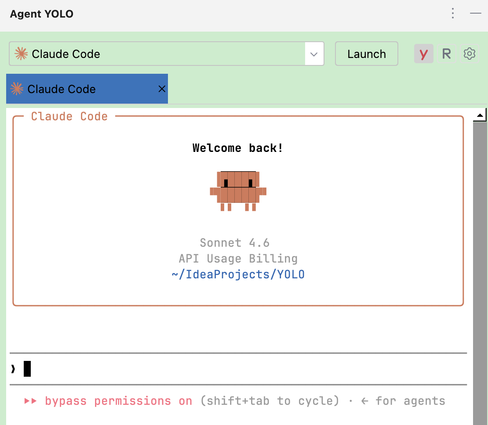

# YOLO: AI Agents Extender

An IntelliJ IDEA plugin that gives you a standalone **YOLO** panel — a dedicated tool window (right side, **y** icon)
that lists your AI CLI tools and lets you launch any of them in **YOLO mode** (skip-permissions) with a single click.

It is built entirely on **public IntelliJ APIs**, so it passes JetBrains Marketplace verification and can be published
like any normal plugin. It does **not** hook into or depend on IDEA's Terminal plugin.



---

## Features

### The YOLO panel

A tool window (right side, **y** icon) that replicates the Terminal's **AI Agents** experience without touching
any internal Terminal API:

- Lists every configured agent — promoted agents (Claude Code, Codex, CodeBuddy, …) plus your own custom tools.
- **Claude Code** and **Codex** are pinned at the top of the list.
- Each row shows the agent's icon, name, and its configured skip flag; rows whose command isn't on `PATH` are dimmed.
- A **YOLO (Skip Permissions)** toggle sits in the panel header, left of the settings gear.

### YOLO mode

A **YOLO (Skip Permissions)** toggle in the panel header. Turn it on and the next Launch starts the agent with its
permission-bypass flag appended — `--dangerously-skip-permissions` for Claude Code, `--yolo` for Codex, `-y` for
CodeBuddy, and so on.

The flag is **per agent** and fully configurable. The plugin knows the correct flag for 17 common agents and
pre-fills it, but every value is editable and nothing is hardcoded at runtime. A few agents (Goose) bypass via an
environment variable instead of a flag; those are handled too.

**The toggle is off by default and never turns itself on.**

### Runs inside the panel (real terminal)

**Selecting an agent in the dropdown launches it immediately** — there is no separate button. The agent opens in a
**real, interactive terminal embedded directly inside the YOLO panel**: a genuine PTY (via JediTerm + PTY4J, the same
terminal emulator the IDE itself bundles) that renders the agent's TUI in place. Prompts, editors, and your rc-defined
`PATH` (nvm / fnm / npm global bin, …) all work because the agent runs through an interactive login shell.

> This is built entirely on **public APIs**: JediTerm and PTY4J are third-party libraries shipped with the IntelliJ
> Platform (not `@ApiStatus.Internal` / `@Experimental` Terminal APIs), so the plugin stays publishable on the
> JetBrains Marketplace. The IDE's own `ConsoleView` is output-only (no interactive input), so a real agent can only
> live in the panel by embedding a true terminal — which is exactly what this does.

> ### Warning — about YOLO mode
>
> Letting an AI agent run commands and edit files **without confirmation** can make irreversible
> changes, execute untrusted code, or expose your system. Those risks come from the agent and the
> bypass flag itself. **This plugin only flips that flag for you — it adds no such behavior of its
> own**, performs no actions on your behalf, and is not responsible for what the agent does.
> Enable YOLO mode only in environments you trust.

---

## Requirements

| | |
|---|---|
| IDE | IntelliJ IDEA **2026.1** or later (`since-build 261`) |
| Dependencies | None beyond the IntelliJ Platform itself — the Terminal plugin is **not** required |

---

## Build

Build with the standard Gradle task:

```bash
./gradlew buildPlugin
# → build/distributions/yolo-{version}.zip
```

**Building against a locally installed IDEA** — by default the plugin compiles against the IntelliJ
SDK pinned in `gradle.properties`. To build against the IDE on your machine instead, create a
`local.properties` file at the project root pointing at its installation:

```properties
localIdeaPath=/Applications/IntelliJ IDEA.app
```

## Installation

**From the Marketplace** — search for **YOLO: AI Agents Extender** in *Settings | Plugins* and install.

**From disk** — build or download the `yolo-<version>.zip` (see [Build](#build)), then
`Settings | Plugins | ⚙ | Install Plugin from Disk…` and pick the zip. Restart when prompted.

---

## Configuration

**`Settings | Tools | YOLO: AI Agents Extender`** — or click the gear in the YOLO panel header.


Everything lives in one table. Each row is an agent, and each row carries its own skip flag:

| Column | Meaning |
|---|---|
| Icon | The bundled icon for promoted agents; your file or a default bolt for custom tools. Greyed out when the command isn't on `PATH` |
| ID | Unique identifier |
| Display name | The name shown in the YOLO panel |
| Command | Executable name — must resolve on `PATH` |
| Base args | Arguments always passed, space separated |
| Skip flag | The permission-bypass argument, appended when the YOLO toggle is on |
| Icon file / URL | A local image or `http(s)` URL — custom tools only |

Rows come in two kinds, listed in descending priority:

1. **Promoted agents** (Claude Code, Codex, CodeBuddy, …) — read-only, sorted with **Claude Code** and
   **Codex** pinned at the top, cannot be removed.
2. **Your own custom tools** — fully editable, in the order you created them.

Only the Skip flag is editable on promoted agents. That's deliberate: the plugin should extend the panel, not take it over.

### Conveniences

- **Skip flags pre-fill themselves.** Open the settings and known agents already have the right
  flag. Type a known ID or command into a new row and it fills in as you go. Values you set by hand
  are never overwritten.
- **Duplicates are caught while you type.** A repeated ID or command turns the status line red
  immediately, and Apply refuses to save. Commands are compared by executable name, so
  `/usr/bin/claude` and `claude.cmd` count as the same tool.
- **Installed agents are detected on each startup.** In the background the plugin checks every known agent's command — first on `PATH`, then by actually running it once (`--version`) — and adds the promoted agents it finds installed. This runs on **every startup, not just the first**, so a tool you install later (e.g. Gemini installed via npm) shows up automatically. It does **not** auto-discover arbitrary tools you wrote yourself — add those as custom tools.
- **Validate** checks a row's command the same way (PATH first, then running it once) and downloads its icon URL if it has one.

### Known agents

Flags below are pre-filled. All of them are editable, and this list is a convenience — not the
source of truth. What runs is whatever the settings say.

| Agent | Command | Skip flag |
|---|---|---|
| Claude Code | `claude` | `--dangerously-skip-permissions` |
| Codex | `codex` | `--yolo` |
| CodeBuddy | `codebuddy` | `-y` |
| Gemini | `gemini` | `--yolo` |
| Copilot | `copilot` | `--allow-all` |
| Cursor | `cursor-agent` | `--force` |
| Kimi | `kimi` | `--yolo` |
| Qoder | `qoder` | `--dangerously-skip-permissions` |
| Hermes | `hermes` | `--yolo` |
| OpenCode | `opencode` | `--auto` |
| Continue | `cn` | `--auto` |
| Cline | `cline` | `--auto-approve true` |
| Goose | `goose` | env `GOOSE_MODE=auto` — not a flag |
| Kilo Code | `kilo` | none — only `kilo run` accepts one |
| OpenClaw | `openclaw` | none — persistent config only |
| Pi | `pi` | `--approve` |

Anything not listed here works fine as a custom tool; just fill in its flag yourself.

---

## Troubleshooting

The plugin logs every launch it touches. To see what actually ran, grep the IDE log
(`<version>` is the IDE's build, e.g. `2026.2`):

```bash
# macOS
grep "AI Agents Extender" ~/Library/Logs/JetBrains/IntelliJIdea<version>/idea.log

# Linux
grep "AI Agents Extender" ~/.cache/JetBrains/IntelliJIdea<version>/log/idea.log

# Windows (PowerShell)
grep "AI Agents Extender" "$env:LOCALAPPDATA\JetBrains\IntelliJIdea<version>\log\idea.log"
```

**An agent is missing from the panel.** Its command isn't resolving on `PATH`. Check the Settings
table — a dimmed entry means not found. Note that the IDE inherits the `PATH` of whatever
launched it, which may differ from your shell's.

**The flag isn't being applied.** Confirm the YOLO toggle is on and the row has a Skip flag. The log
line for each launch shows the final command, including whether anything was injected.

**Settings changes don't take effect.** The plugin registers a `Configurable`, which IDEA cannot
load dynamically. Restart the IDE after installing or updating.
