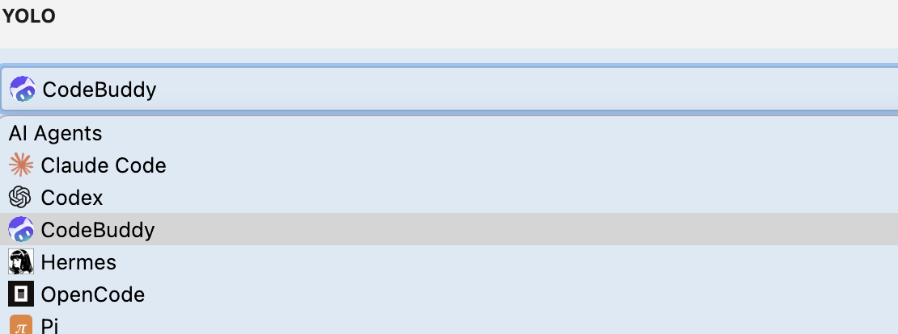
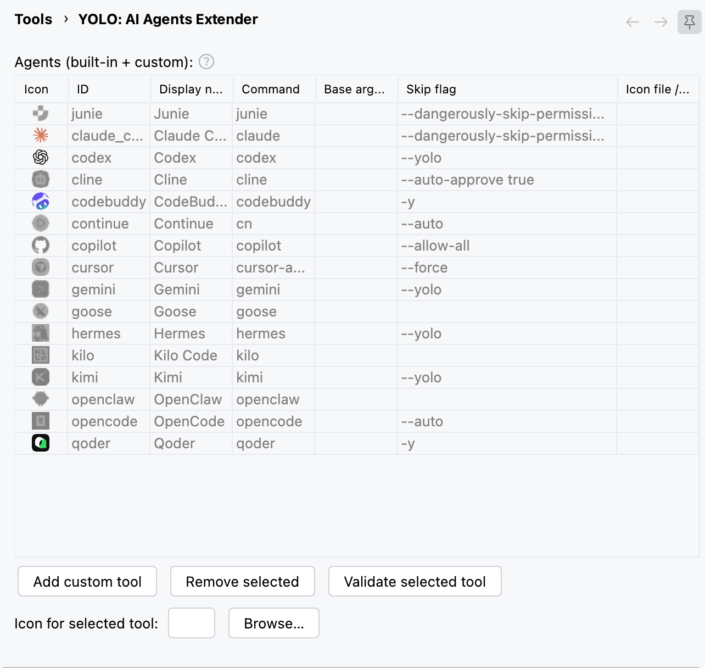

# YOLO: AI Agents Extender

An IntelliJ IDEA plugin that extends the Terminal's **AI Agents** dropdown with your own CLI tools,
and lets you launch any of them in **YOLO mode** — with their permission-bypass flag — from a single toggle.

IDEA ships the dropdown with Junie, Claude Code and Codex. If your agent of choice isn't one of
those, it isn't there. And whichever agent you use, you still confirm every action it takes.
This plugin addresses both.

---

## Features

### Extend the AI Agents dropdown




Add any AI CLI — Gemini, Copilot, Cursor, Cline, OpenCode, or something you wrote yourself — to the
Terminal's AI Agents menu, with its own display name and icon. IDEA's built-in agents are never
replaced or reordered; your tools are appended.

An agent only appears in the dropdown if its command resolves on `PATH`. That's the terminal's own
rule, not the plugin's — the Settings table greys out the icon of anything it can't find, so you can
see at a glance what's actually installed.

### YOLO mode


A **YOLO (Skip Permissions)** toggle sits in the Terminal toolbar, immediately left of the AI Agents
dropdown. Turn it on and the next agent you launch starts with its permission-bypass flag appended —
`--dangerously-skip-permissions` for Claude Code, `--yolo` for Codex, `--allow-all` for Copilot, and so on.

The flag is **per agent** and fully configurable. The plugin knows the correct flag for 17 common
agents and pre-fills it, but every value is editable and nothing is hardcoded at runtime. A few
agents (Goose) bypass via an environment variable instead of a flag; those are handled too, since an
env var has to be set before the process starts rather than appended to the command line.

**The toggle is off by default and never turns itself on.**

A gear button on the right of the dropdown opens the plugin's settings directly.

> ### Warning — about YOLO mode
>
> Letting an AI agent run commands and edit files **without confirmation** can make irreversible
> changes, execute untrusted code, or expose your system. Those risks come from the agent and the
> bypass flag itself. **This plugin only flips that flag for you — it adds no such behavior of its
> own**, performs no actions on your behalf, and is not responsible for what the agent does.
> Enable YOLO mode only in environments you trust.

---

## Requirements

| | |
|---|---|
| IDE | IntelliJ IDEA **2026.1** or later (`since-build 261`) |
| Bundled plugin | Terminal (`org.jetbrains.plugins.terminal`) — enabled by default |

The Terminal AI Agents dropdown was opened to third-party agents in 2026.1; on earlier versions the
extension points this plugin relies on do not exist.

## Build

Build with the standard Gradle task:

```bash
./gradlew buildPlugin
# → build/distributions/yolo-{version}.zip
```

**Building against a locally installed IDEA** — by default the plugin compiles against the IntelliJ
SDK pinned in `gradle.properties`. To build against the IDE on your machine instead, create a
`local.properties` file at the project root pointing at its installation:

```properties
localIdeaPath=/Applications/IntelliJ IDEA.app
```

This overrides the SDK with your local IDE, which is useful when matching a specific IDE version or
testing against an internal API that differs from the pinned SDK.

## Installation

**From disk** — build or download the `yolo-<version>.zip` (see [Build](#build)), then
`Settings | Plugins | ⚙ | Install Plugin from Disk…` and pick the zip. Restart when prompted.

### Releases

This plugin relies heavily on IntelliJ **Internal** APIs — the Terminal AI Agents extension points
it hooks into are marked internal. Plugins that depend on internal API are rejected by JetBrains
Marketplace verification, so **this plugin is not published to the Marketplace**.

Get builds from the **Releases** page of this repository: download the `yolo-<version>.zip` and
install it with *Install Plugin from Disk…* as described above.

---

## Configuration

**`Settings | Tools | YOLO: AI Agents Extender`** — or click the gear in the Terminal toolbar.



Everything lives in one table. Each row is an agent, and each row carries its own skip flag:

| Column | Meaning |
|---|---|
| Icon | IDEA's own icon for built-in agents; your file or a default bolt for custom tools. Greyed out when the command isn't on `PATH` |
| ID | Unique identifier |
| Display name | The name shown in the dropdown |
| Command | Executable name — must resolve on `PATH` |
| Base args | Arguments always passed, space separated |
| Skip flag | The permission-bypass argument, appended when the YOLO toggle is on |
| Icon file / URL | A local image or `http(s)` URL — custom tools only |

Rows come in three kinds, listed in descending priority:

1. **IDEA built-in agents** — read-only, cannot be removed, keep IDEA's icons
2. **Agents this plugin knows about** (Gemini, Cline, CodeBuddy, …) — read-only, sorted by ID
3. **Your own custom tools** — fully editable, in the order you created them

Only the Skip flag is editable on the first two kinds. That's deliberate: the plugin should extend
the dropdown, not take it over.

### Conveniences

- **Skip flags pre-fill themselves.** Open the settings and known agents already have the right
  flag. Type a known ID or command into a new row and it fills in as you go. Values you set by hand
  are never overwritten.
- **Duplicates are caught while you type.** A repeated ID or command turns the status line red
  immediately, and Apply refuses to save. Commands are compared by executable name, so
  `/usr/bin/claude` and `claude.cmd` count as the same tool.
- **Installed agents are detected on each startup.** In the background the plugin checks every known agent's command — first on `PATH`, then by actually running it once (`--version`) — and adds the promoted agents it finds installed. This runs on **every startup, not just the first**, so a tool you install later (e.g. Gemini installed via npm) shows up automatically. It does **not** auto-discover arbitrary tools you wrote yourself — add those as custom tools.
- **Validate** checks a row's command the same way (PATH first, then running it once) and downloads its icon URL if it has one.

### Known agents

Flags below are pre-filled. All of them are editable, and this list is a convenience — not the
source of truth. What runs is whatever the settings say.

| Agent | Command | Skip flag |
|---|---|---|
| Junie | `junie` | `--dangerously-skip-permissions` |
| Claude Code | `claude` | `--dangerously-skip-permissions` |
| Codex | `codex` | `--yolo` |
| CodeBuddy | `codebuddy` | `-y` |
| Gemini | `gemini` | `--yolo` |
| Copilot | `copilot` | `--allow-all` |
| Cursor | `cursor-agent` | `--force` |
| Kimi | `kimi` | `--yolo` |
| Qoder | `qoder` | `--dangerously-skip-permissions` |
| Hermes | `hermes` | `--yolo` |
| OpenCode | `opencode` | `--auto` |
| Continue | `cn` | `--auto` |
| Cline | `cline` | `--auto-approve true` |
| Goose | `goose` | env `GOOSE_MODE=auto` — not a flag |
| Kilo Code | `kilo` | none — only `kilo run` accepts one |
| OpenClaw | `openclaw` | none — persistent config only |
| Pi | `pi` | `--approve` |

Anything not listed here works fine as a custom tool; just fill in its flag yourself.

---

## Troubleshooting

The plugin logs every launch it touches. To see what actually ran, grep the IDE log
(`<version>` is the IDE's build, e.g. `2026.2`):

```bash
# macOS
grep "AI Agents Extender" ~/Library/Logs/JetBrains/IntelliJIdea<version>/idea.log

# Linux
grep "AI Agents Extender" ~/.cache/JetBrains/IntelliJIdea<version>/log/idea.log

# Windows (PowerShell)
grep "AI Agents Extender" "$env:LOCALAPPDATA\JetBrains\IntelliJIdea<version>\log\idea.log"
```

**An agent is missing from the dropdown.** Its command isn't resolving on `PATH`. Check the Settings
table — a greyed-out icon means not found. Note that the IDE inherits the `PATH` of whatever
launched it, which may differ from your shell's.

**The flag isn't being applied.** Confirm the YOLO toggle is on and the row has a Skip flag. The log
line for each launch shows the final command, including whether anything was injected.

**Settings changes don't take effect.** The plugin registers a `Configurable`, which IDEA cannot
load dynamically. Restart the IDE after installing or updating.